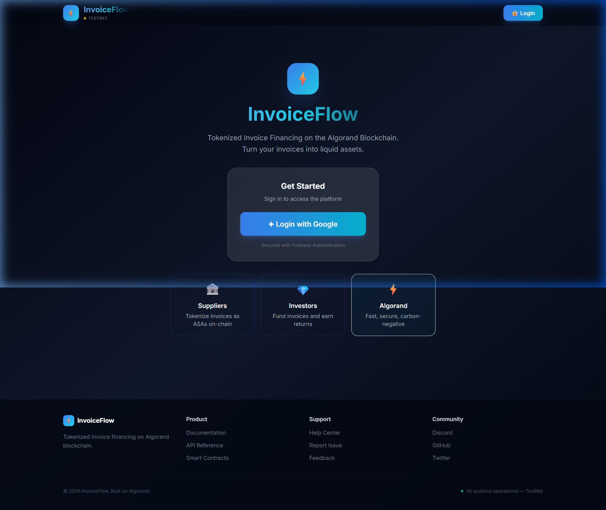
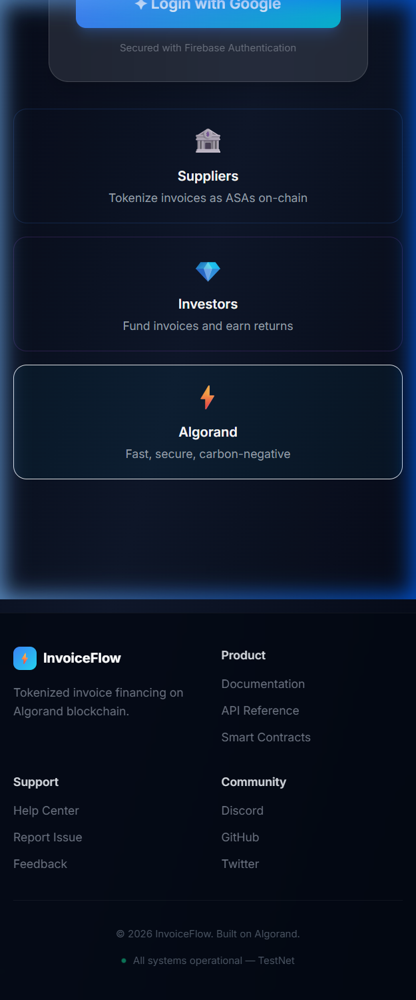

# InvoiceFlow — Tokenized Invoice Financing on Algorand


A cutting-edge decentralized finance (DeFi) platform for **tokenized invoice financing** built on the **Algorand blockchain**. Suppliers tokenize invoices as ASAs, investors fund them with AI-driven risk assessment, and settlements are automated via secure atomic transactions.

---

## 📸 Screenshots

### Desktop — Login & Hero


### Mobile — Responsive Layout


### UI Demo Recording


---

## 🚀 Features

### Core Functionality
- **Invoice Tokenization** — Convert invoices into Algorand Standard Assets (ASA) for on-chain trading
- **Smart Contracts** — PyTeal contracts for secure financing, settlement, and ownership transfer
- **Atomic Transactions** — All-or-nothing execution prevents partial failures
- **AI Risk Scoring** — Intelligent evaluation of invoice risk and recommended interest rates
- **Liquidity Pool** — Decentralized funding pool for investors with deposit/withdrawal
- **Automated Settlement** — On-due-date settlement with interest calculation
- **Pera Wallet Integration** — Native `@perawallet/connect` SDK with session persistence and reconnection

### Frontend & UX
- **Premium Fintech UI** — Glassmorphism, gradient borders, animated counters, micro-interactions
- **Wallet Modal** — Centered modal for wallet connection with step-by-step guide
- **Animated Analytics** — Count-up metrics, gradient progress bars, transaction timeline
- **Responsive Design** — Fully responsive from mobile (375px) to desktop (1440px+)
- **Dark Mode** — Sleek dark theme with custom scrollbars and selection colors
- **10+ CSS Animations** — Fade-in, slide-up, scale-in, float, shimmer, pulse-glow, stagger, gradient-shift
- **Deposit Modal** — Proper in-app deposit flow (no `window.prompt`)
- **Dismissible Alerts** — Error and success messages with close buttons

### Backend & API
- **RESTful API** — Comprehensive Express.js API for all CRUD operations
- **Transaction Logging** — Complete audit trail of all operations
- **Risk Scoring Engine** — Multi-factor AI evaluation model
- **Production-Ready** — Error handling, validation, CORS, and auth-ready

---

## 🏗️ Architecture

```
InvoiceFlow/
├── frontend/               # React 18 + Tailwind CSS 3 dashboard
│   └── src/
│       ├── App.js              # Main shell, routing, wallet modal
│       ├── firebase.js         # Firebase Auth (Google SSO)
│       ├── index.css           # Design system (glassmorphism, animations)
│       └── components/
│           ├── WalletConnect.js     # Pera Wallet SDK integration
│           ├── SupplierPanel.js     # Invoice creation & management
│           ├── InvestorPanel.js     # Funding, risk assessment, deposits
│           └── Analytics.js         # Platform metrics & transaction log
├── backend/                # Node.js + Express API server
│   └── server.js               # REST API, in-memory store, risk scoring
├── smart-contracts/        # PyTeal smart contracts for Algorand
│   ├── invoice_contract.py     # Invoice tokenization & settlement logic
│   └── compile.py              # Contract compilation utility
├── ai-service/             # Python FastAPI risk scoring service
├── scripts/                # Setup & deployment scripts
└── docs/                   # Screenshots & documentation
```

---

## 🛠️ Tech Stack

| Layer | Technology |
|-------|-----------|
| **Blockchain** | Algorand TestNet, PyTeal, AlgoSDK |
| **Frontend** | React 18, Tailwind CSS 3, `@perawallet/connect` |
| **Auth** | Firebase Authentication (Google SSO) |
| **Backend** | Node.js, Express.js |
| **AI/ML** | Python, FastAPI, NumPy |
| **Design** | Glassmorphism, CSS animations, Inter font |

---

## 📋 Prerequisites

- **Node.js** >= 16.0.0
- **Python** >= 3.8
- **npm** or **yarn**
- **Algorand TestNet** access
- **Pera Wallet** app on your phone (for QR code scanning)

---

## 🚀 Quick Start

### 1. Clone & Install

```bash
git clone <repo-url>
cd infinova-hackathon
```

### 2. Start Backend

```bash
cd backend
npm install
npm start
# Runs on http://localhost:3001
```

### 3. Start AI Service (optional)

```bash
cd ai-service
pip install -r requirements.txt
python main.py
# Runs on http://localhost:8000
```

### 4. Start Frontend

```bash
cd frontend
npm install
npm start
# Opens http://localhost:3000
```

### 5. Connect & Trade

1. Sign in with Google (Firebase Auth)
2. Click **"Connect Wallet"** → scan QR with Pera Wallet app
3. Create invoices (Supplier tab) or fund them (Investor tab)
4. Monitor platform metrics on the Analytics tab

---

## 🔗 Pera Wallet Integration

The wallet integration uses the official `@perawallet/connect` npm SDK:

```javascript
import { PeraWalletConnect } from '@perawallet/connect';

const peraWallet = new PeraWalletConnect({ chainId: 416002 }); // TestNet

// Connect
const accounts = await peraWallet.connect();

// Reconnect on page refresh
const accounts = await peraWallet.reconnectSession();

// Disconnect
await peraWallet.disconnect();
```

**Features:**
- Session persistence across page refreshes via `reconnectSession()`
- Proper disconnect lifecycle with SDK cleanup
- Graceful handling of user-cancelled modals
- Singleton instance pattern to avoid duplicate connections
- Network indicator badge (TestNet / MainNet)

---

## 📱 User Workflows

### Supplier Workflow
1. Sign in → Connect Pera Wallet
2. Create invoice with buyer address, amount, and due date
3. Invoice tokenized as ASA on Algorand
4. Request financing — investors notified
5. Receive funds upon investor approval
6. Invoice ownership transferred to financier

### Investor Workflow
1. Sign in → Connect Pera Wallet → Deposit ALGO to pool
2. Browse available invoices with AI risk scores
3. Select financing amount and interest rate
4. Fund invoice via atomic transaction
5. Receive repayment at maturity + earned interest

---

## 📊 API Endpoints

### Invoices
```
POST   /api/invoices              Create invoice
GET    /api/invoices              List all invoices
GET    /api/invoices/:id          Get invoice details
POST   /api/invoices/:id/finance  Finance an invoice
POST   /api/invoices/:id/settle   Settle an invoice
```

### Risk Scoring
```
POST   /api/risk-score            Calculate AI risk score
```

### Liquidity Pool
```
POST   /api/pool/deposit          Deposit ALGO to pool
GET    /api/pool/:address         Get pool balance
```

### Analytics & Health
```
GET    /api/analytics             Platform metrics
GET    /api/transactions          Transaction logs
GET    /api/health                Health check
```

---

## 🔍 AI Risk Scoring Model

The AI service evaluates invoices using a weighted multi-factor model:

| Factor | Weight | Description |
|--------|--------|-------------|
| Supplier History | 25% | Past performance and reliability |
| Credit Score | 20% | Financial creditworthiness |
| Amount Risk | 15% | Invoice size vs. market exposure |
| Payment Timeliness | 15% | On-time payment ratio |
| Due Date | 10% | Payment term length |
| Transaction Count | 10% | Experience and volume |
| Default History | 5% | Past defaults |

**Output:** Risk Level (Low / Medium / High) + Suggested Interest Rate

| Risk Level | Interest Rate | Recommended Funding | Risk Score |
|-----------|---------------|-------------------|-----------|
| Low | 5% | 100% | ≥ 0.70 |
| Medium | 10% | 80% | 0.40 – 0.70 |
| High | 20% | 60% | < 0.40 |

---

## 🎨 Design System

The frontend uses a custom CSS design system built on Tailwind CSS 3:

### Components
- `.glass` / `.glass-strong` — Glassmorphism cards with backdrop blur
- `.gradient-text` — Gradient text clipping (blue → cyan → teal)
- `.card-hover` — Cards with hover lift, border glow, and scale
- `.btn-primary` / `.btn-secondary` / `.btn-ghost` — Button variants with scale transforms
- `.badge-success` / `.badge-warning` / `.badge-danger` / `.badge-info` — Status badges
- `.input` — Styled inputs with focus ring animations
- `.gradient-border` — CSS mask-based gradient borders

### Animations
| Class | Effect |
|-------|--------|
| `.animate-fade-in` | Fade + translateY |
| `.animate-slide-up` | Slide up with fade |
| `.animate-scale-in` | Scale from 0.92 → 1 |
| `.animate-float` | Gentle vertical float |
| `.animate-shimmer` | Shimmer sweep overlay |
| `.animate-pulse-dot` | Pulsing connection dot |
| `.animate-gradient` | Background gradient shift |
| `.stagger-children` | Staggered child delays (80ms intervals) |

---

## 🔐 Security

- ✅ Firebase Authentication (Google SSO)
- ✅ Input validation on all API endpoints
- ✅ Algorand address format verification (58-char, starts with A)
- ✅ Amount range checks
- ✅ Atomic transaction guarantees
- ✅ CORS protection
- ✅ State immutability on blockchain
- ✅ Error logging and monitoring

---

## 📈 Performance

- **Transaction Finality**: < 5 seconds (Algorand)
- **API Response Time**: < 200ms average
- **Frontend Build**: Optimized React 18 with code splitting
- **Throughput**: 1000+ TPS (Algorand network)
- **Wallet Reconnect**: Instant session restoration

---

## 🧪 Testing

```bash
# Frontend tests
cd frontend && npm test

# Backend tests
cd backend && npm test

# Smart contract tests
cd smart-contracts && pytest tests/
```

---

## 🌐 Deployment

### Local Development
```bash
# Start all services
cd backend && npm start        # Terminal 1
cd ai-service && python main.py # Terminal 2
cd frontend && npm start        # Terminal 3
```

### TestNet
1. Configure `.env` with TestNet RPC endpoints
2. Deploy contracts to TestNet
3. Update frontend configuration
4. Run: `npm run deploy:testnet`

### Production
1. Audit smart contracts
2. Configure MainNet endpoints
3. Enable production security settings
4. Deploy with: `npm run deploy:mainnet`

---

## 🤝 Contributing

```bash
git checkout -b feature/your-feature
git commit -m 'Add your feature'
git push origin feature/your-feature
# Open Pull Request
```

---

## 📄 License

MIT License — see [LICENSE](LICENSE) for details.

## 🙏 Acknowledgments

- [Algorand Foundation](https://www.algorand.com) — blockchain infrastructure
- [Pera Wallet](https://perawallet.app) — wallet SDK
- [PyTeal](https://pyteal.readthedocs.io) — smart contract framework
- [React](https://react.dev) & [Tailwind CSS](https://tailwindcss.com) — frontend

---

**Built with ❤️ for the Algorand and DeFi communities**

Made for Infinova Hackathon 2026 🏆